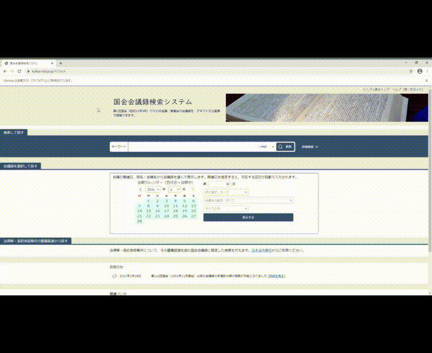

# Make-LINE-Chat-History-with-the-Diet-Record

This tool enables you to make a LINE like chat history with the Diet Record extracted from the websites by web scraping.

# DEMO

When you run "scraping.py"



# Features

With the LINE like chat history you made, you can use my web app [Grou Cha Darby](https://grouchadarby0210.herokuapp.com/) without exposing your personal information on the Internet.

# Requirement

* Python 3.8.5
* chromedriver-binary 86.0.4240.22.0
* selenium 3.141.0

# Installation

```bash
pip install chromedriver-binary
pip install selenium
```

# Usage

```bash
git clone https://github.com/Kitsuya0828/Make-LINE-Chat-History-with-the-Diet-Record.git
cd Make-LINE-Chat-History-with-the-Diet-Record
python scraping.py
```
By default, text files will be downloaded to the “Downloads” folder in your user account. 

Move all text files you downloaded to the "statements" folder directly under the "Make-LINE-Chat-History-with-the-Diet-Record" folder.

```bash
python editing.py > chat_log.txt
```

# Note

When your ChromeDriver is not compatible with the installed Chrome Browser, please update your ChromeDriver to the appropriate version.

[Downloads - ChromeDriver - WebDriver for Chrome](https://chromedriver.chromium.org/downloads)

# Author

* Kitsuya Azuma
* Tohoku University
* kitsuyaazuma@gmail.com

# License

"Make-LINE-Chat-History-with-the-Diet-Record" is under [MIT license](https://en.wikipedia.org/wiki/MIT_License).


Thank you!
